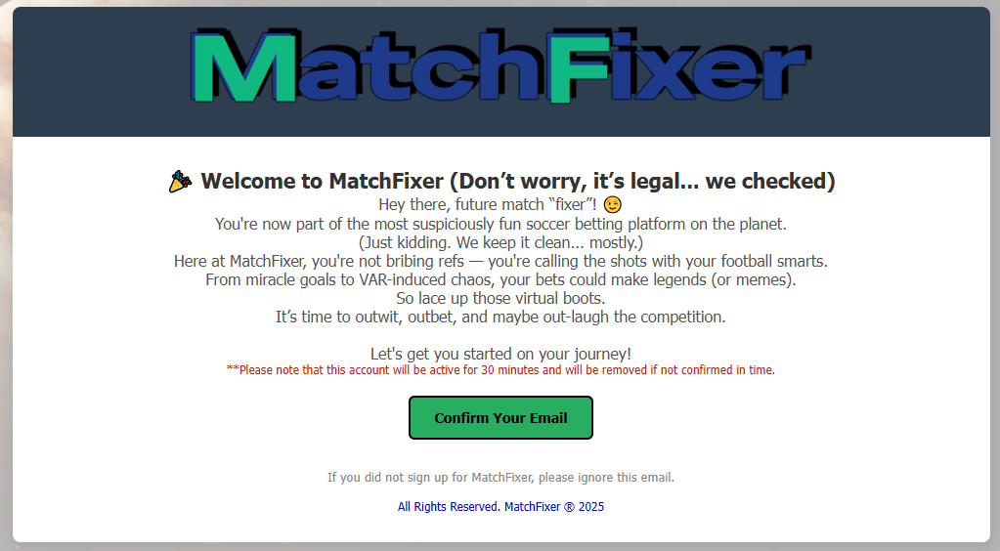
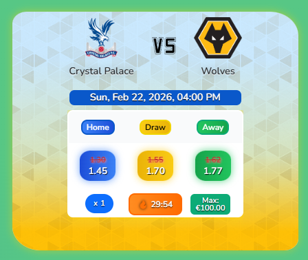
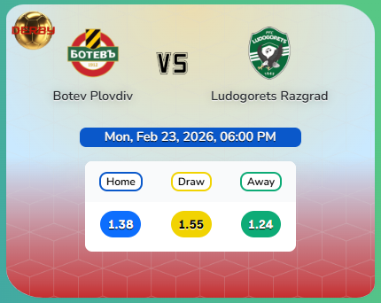
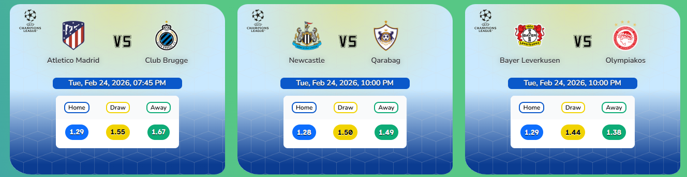
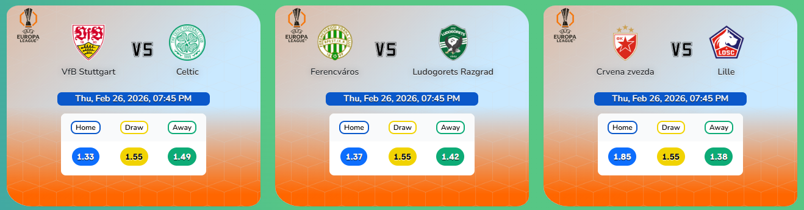
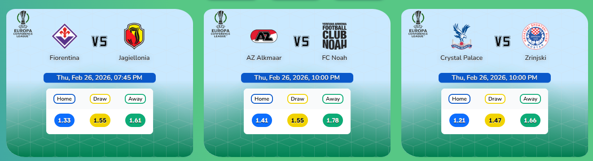
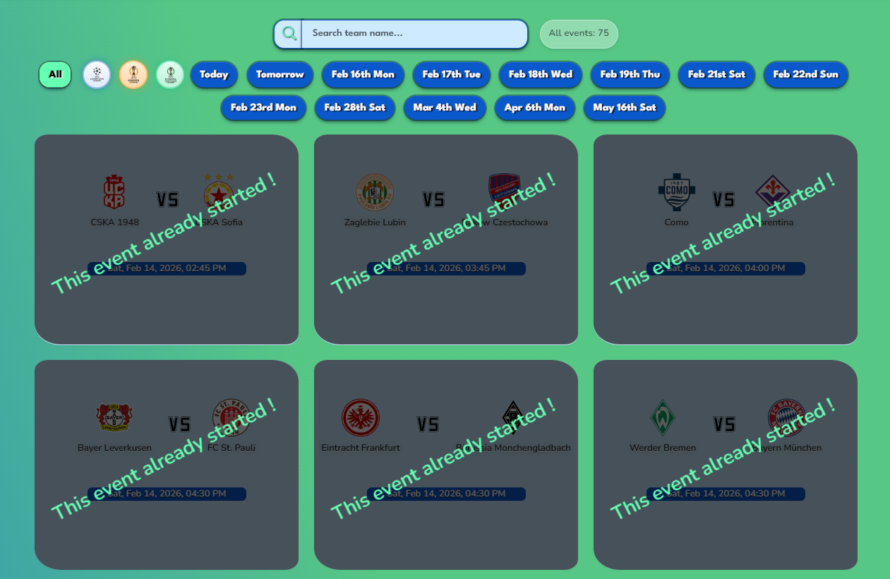
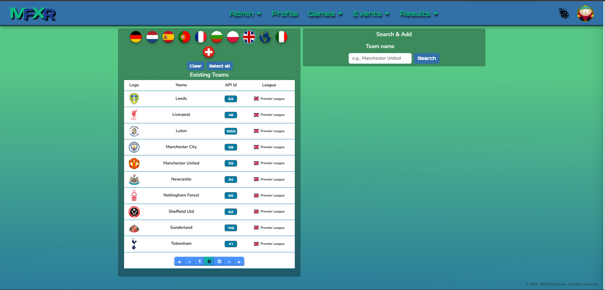
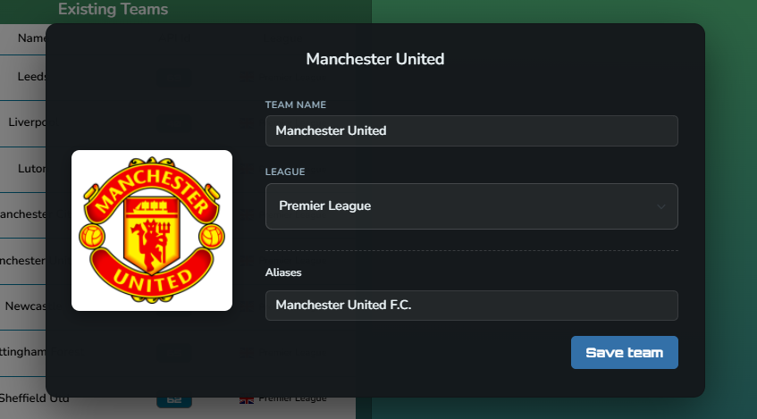

<h1 align="center" style="inline-block">:construction: :construction: UNDER CONSTRUCTION :construction: :construction:</h1>

  

<h3 align="center">MatchFixer Confirmation Email</h3>

  

  

  

  

<h3 align="center">Boosted events showcasing on the Home Page</h3>

  

<h3 align="center">Manchester United custom wiki tooltip</h3>

  

<h3 align="center">Derby and Boosted Events</h3>

<h4 align="center">Boosted Events</h4>

  

<h4 align="center">Derby Match Events</h4>

  

<h3 align="center">Competition Cards Styling and Animations ( UCL / UEL / UECL )</h3>

<h4 align="center">Champions League</h4>

  

<h4 align="center">Europa League</h4>

  

<h4 align="center">Conference League</h4>

  

<h3 align="center">Style of events that already started</h3>

  

<h3 align="center">League Tables View for the TOP 7 Leagues</h3>

  

<h3 align="center">Admin Teams View</h3>

  

<h4 align="center">Boosted Events</h4>

  

